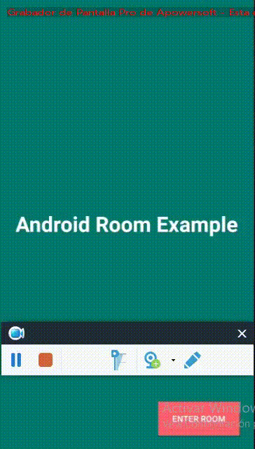

# Kamer
---
:rocket: :door: Room + LiveData = Kamer 

  
  
  

Another simple todo-list app made with :
- [Room Persistence Library](https://developer.android.com/topic/libraries/architecture/room)
- [LiveData](https://developer.android.com/reference/android/arch/lifecycle/LiveData)
